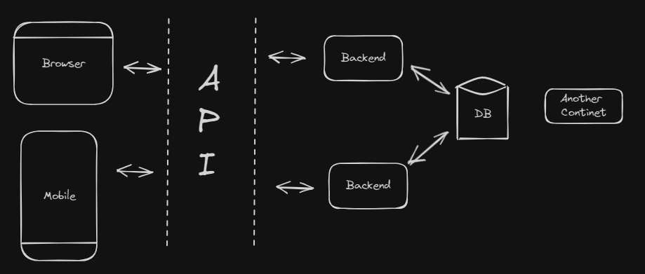

## Introduction to Backend

### 2 Major Components

1. **A programming language**
   - Java, Js, PHP, Go lang, C++ 
   - We use some kind of framework of all these languages to make development easy.
2. **A Database**
   - MongoDB, MySql, Postgres, Sqlite 
   - ORM, ODM

###  Workflow

### Backend in JS
- A JS based backend deals with three things 
  1. Data
  2. File
  3. Third Party API
- A JS runtime is required : Nodejs/Deno/Bun
- A package.json
- .env - to store environment variables
- Other things: Readme, git, lint,prettier etc.
- src
  - index.js - Code for db connection
  - app.js - Config, Cookie, url encoded etc.
  - contants - enums, DB-name
- General Directory Structure