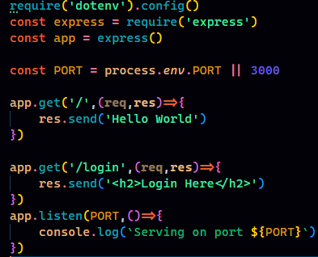

## Creating a node js server

### Initializing node 
- Download and Install Node js
- Check version after installing in terminal: `node --version` and `npm --version`.
- As long as a version is displayed, we are good to go.

- Create a project/folder and open it in vs code. My project name: `backend-tutorial`
- Open VS code terminal or terminal of your choice inside this folder.
- Type and run `npm init`

    

- It will ask for the following things with some of them having default values:
  - package name
  - version
  - description: We can describe our app here
  - entry point
  - test command
  - git repository
  - keywords
  - author
  - license
- Just keep pressing `enter` if you don't want to write anything
- We can also run `npm init -y` to skip this menu.
- This will create a `package.json` file where we can change all this if we want.
  
  

- package.json

  

### Creating a basic server
- We will be using `express` framework to create a basic server.
- Express is a *fast*, *unopinionated*, *minimalist* web framework for node js.
- We can do anything we want to do with express js using standalone node js but express js makes it easier to write node js webapp.
- Install express using `npm install express` command in terminal
- Create a file `index.js` in the root directory. Here is the code for basic server setup.
  
  

- ***Explaination***
  - `const express = require('express');`
    - Imports the Express.js library. This allows you to use the functionalities provided by Express in your application.
  - `const app = express();`
    - Creates an instance of the Express application. This instance (app) is where you define routes, middleware, and other settings for your web application.
  - `const PORT = process.env.PORT || 3000;`
    - Defines the port number the server will listen on. It uses the environment variable PORT if available (commonly set by hosting services like Heroku) or defaults to port 3000.
  - `app.get('/', (req, res) => { res.send('Hello World'); });`
    - Defines a route for handling HTTP GET requests to the root URL ('/'). When a user accesses the root URL, the server responds with the plain text message 'Hello World'.
  - `app.get('/login', (req, res) => { res.send('<h2>Login Here</h2>'); });`
    - Defines another route for handling GET requests to the '/login' URL. When a user accesses '/login', the server responds with an HTML message `<h2>Login Here</h2>`.
  - `app.listen(PORT, () => { console.log(Serving on port ${PORT}); });`
    - Makes the Express application listen on the specified port (PORT). When the server starts, it logs a message indicating that it is serving on the specified port. The callback function is optional and runs once the server has started listening.

- In the terminal type and run: `node index.js`
  
  

- And now if we go to `localhost:3000` in our browser
  
  

- And now if we go to `localhost:3000/login` in our browser
  
  

- ***Important***: Running our app using `node index.js` is not a good way instead we can define a **start** script inside package.json file to run our app. This is how we define a start script.
  
  

- Now we can simply run our app using `npm run start` or `npm start` in terminal.
- We should do this because:
  - `node any.js` - This will simply run the javascript file "any.js". So if there is no code in there to start a server, we will get error.
  - `npm start` - It will run the start command in the package.json.

### Optimizing our basic server code
- Sensitive information, such as API keys or database credentials, should not be hardcoded into the source code. By using a `.env` file, which is typically added to .gitignore, we can keep sensitive information separate from the codebase and prevent it from being unintentionally exposed or committed to version control.
- We should add the `port number` inside `.env` file.
- Different environments (development, testing, production) may require different port configurations. By keeping the port number in a .env file, we can easily customize it for each environment.
- Placing the port number in a dedicated configuration file makes it simple to change without modifying the source code. This is particularly important when deploying your application to different servers or platforms. Each environment can have its own .env file with the appropriate port number.
- To do this we first need to install `dotenv` package. `npm install dotenv`
- Then create a `.env` file in the root directory. 
- In the `.env` file, specify all the environment variables.
  
  

- Using the environment variable in `.env` in `index.js`
  
  

- ***Explaination***:
  - `require('dotenv').config();`
    - The require function in Node.js is used to import modules. In this case, it's importing the dotenv module.
    - The config function is a method provided by the dotenv module. When called, it reads the contents of a file named .env in the root directory of the project and loads the environment variables defined in that file into the process.env object.
  - `const PORT = process.env.PORT || 3000;`
    -  **process.env.PORT** is accessing the PORT property of the process.env object. The process.env object in Node.js provides access to the environment variables of the current process. In this case, it's specifically looking for an environment variable named PORT.
    - **||**: This is the logical OR operator. It's used here to provide a default value (3000) if the process.env.PORT is falsy (undefined, null, false, 0, etc.).
    - 3000: This is the default value assigned to PORT if process.env.PORT is falsy.