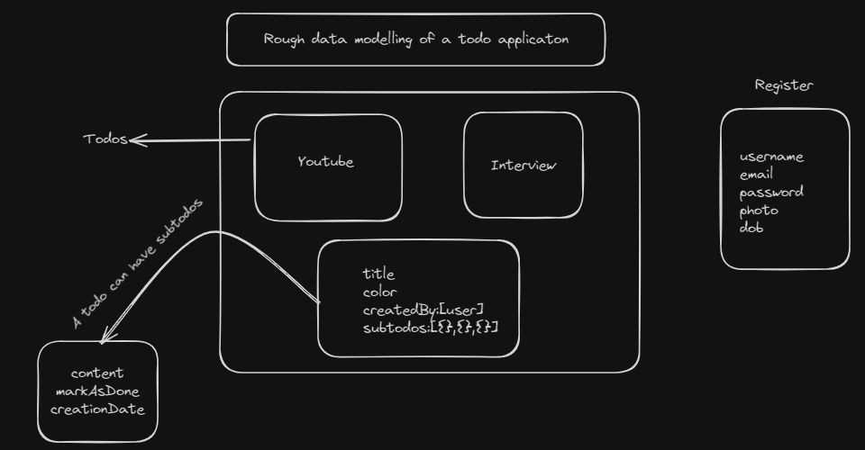
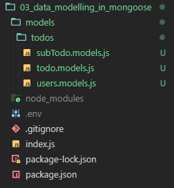

### Data modelling for backend with mongoose

### Important
-  First, it's important to have clarity about the fields, what data will be stored. Analyze it thoroughly. Then, we will decide how to do it, where to do it.

> In hindi: Sabse pehle fields ke baare me clarity rakhna hoga, kya kaya data store honge. Achhe se analyse karna hoga.
> Then decide karenge ki kaise karna hoga, kaha karna hoga

### Tools for Data modelling
- **moon-modeler** (paid)
- **eraser.io**
- pen and paper

### Example



- ***So first do this object modelling in any tool or on pen an paper. Ask questions to yourself.***

### Mongoose
- Mongoose is a helper library that helps in mongodb object modelling.
- Install mongoose inside your app using `npm i mongoose`

### Creating models
- Directory Structure

  

- `filename.models.js` is a good convention.
- I am going to define user modelling. So I will go to `users.models.js`
- ***3 basic steps*** that one need to perform:
  1. Import
    - `import mongoose from 'mongoose'`
      - This line imports the Mongoose library
  2. Create new Schema
    - `const userSchema  = new mongoose.Schema({})`
      - This line creates a new instance of the mongoose.Schema class which is used to define the structure of documents that will be stored in the MongoDB collection.
      - It takes object as input.
  3. Export the schema as model
    - `export const User = mongoose.model('User',userSchema)`
      - This line creates a Mongoose model named 'User' based on the defined schema (userSchema).
      - This function takes two arguments: the name of the model ('User' in this case) and the schema to be associated with it.
      - The export statement makes the User model available for use in other parts of your application.
    ```
    import mongoose from 'mongoose'

    const userSchema  = new mongoose.Schema({})

    export const User = mongoose.model('User',userSchema)
    ```
    
    `Very important points`
    - Mongoose, by default, follows a naming convention when creating collections in MongoDB. It takes the singular name of the model, converts it to lowercase, and then pluralizes it to form the collection name.
    - In this case, the 'User' model would result in a MongoDB collection named 'users'.
    - If you were to save a document using this 'User' model, Mongoose would automatically interact with a MongoDB collection named 'users'.
    - For instance, when you perform operations like creating, querying, or updating documents using the 'User' model, Mongoose translates these actions to MongoDB queries on the 'users' collection.
  
  > In Hindi - Import karo, Schema banao - schema me objects aayenge , export kar lo schema ko as a model
  > mongoose.model ke andar jo '' ke within me naam denge - us naam ko mongoose lowercase aur plural bana kar collection bana dega mongodb me 

- Creating fields
  - 2 ways
    - 1st way (without any property) (Not recommended)
        ```
            import mongoose from 'mongoose'

            const userSchema  = new mongoose.Schema(
            {
                username:String,
                email:String,
                isActive:Boolean
            }
        )

            export const User = mongoose.model('User',userSchema)
        ```
    - 2nd Way (With properties)
        ```
            import mongoose from 'mongoose'

            const userSchema  = new mongoose.Schema(
                {
                    username:{
                        type:String,
                        required:true,
                        unique:true,
                        lowercase:true
                    },
                    email:{
                        type:String,
                        require:true,
                        unique:true,
                        lowercase:true
                    },
                    password:{
                        type:String,
                        required:true
                    }
                }
            )

            export const User = mongoose.model('User',userSchema)
        ```
- timestamps
  - Mongoose schemas support a timestamps option. If you set timestamps: true, Mongoose will add two properties of type Date to your schema:    
    - createdAt: a date representing when this document was created
    - updatedAt: a date representing when this document was last updated
  - We can create timepass using mongoose.Schema only. Timestamps is added as a second object to the `mongoose.Schema`
  - `const userSchema = new Schema({ name: String }, { timestamps: true });`
- Full Code:
  ```
    import mongoose from 'mongoose'

    const userSchema  = new mongoose.Schema(
        {
            username:{
                type:String,
                required:true,
                unique:true,
                lowercase:true
            },
            email:{
                type:String,
                require:true,
                unique:true,
                lowercase:true
            },
            password:{
                type:String,
                required:true
            }
        },
        {
            timestamps:true
        }
    )

    export const User = mongoose.model('User',userSchema)
  ```
- Establishing Relationship between different Models
  
  ***users.models.js***
  ```
    import mongoose from 'mongoose';

    const userSchema = new mongoose.Schema(
    {
        username: {
        type: String,
        required: true,
        unique: true,
        lowercase: true,
        },
        email: {
        type: String,
        require: true,
        unique: true,
        lowercase: true,
        },
        password: {
        type: String,
        required: true,
        },
    },
    {
        timestamps: true,
    }
    );

    export const User = mongoose.model('User', userSchema);
  ```
    ***subTodo.models.js***
  ```
    import mongoose from 'mongoose';

    const subTodoSchema = new mongoose.Schema(
    ({
        content: {
        type: String,
        required: true,
        },
        complete: {
        type: Boolean,
        default: false,
        },
        createdBy: {
        type: mongoose.Schema.Types.ObjectId,
        ref: 'User',
        },
    },
    { timestamps: true })
    );

    export const SubTodo = mongoose.model('SubTodo', subTodoSchema);
  ```
  ***todo.models.js***
  ```
    import mongoose from 'mongoose';

    const todoSchema = new mongoose.Schema(
    {
        content: {
        type: String,
        required: true,
        },
        complete: {
        type: Boolean,
        default: false,
        },
        createdBy: {
        type: mongoose.Schema.Types.ObjectId,
        ref: 'User',
        },
        subTodos: [
        {
            type: mongoose.Schema.Types.ObjectId,
            ref: 'SubTodo',
        },
        ],
    },
    {
        timestamps: true,
    }
    );

    export const Todo = mongoose.model('Todo', todoSchema);
  ```
   - Relationships
    1.  
    ```
        createdBy: {
            type: mongoose.Schema.Types.ObjectId,
            ref: 'User',
        },
    ```

    - This field is a reference to another document in the MongoDB database.
    - `mongoose.Schema.Types.ObjectId`: It is specifying that the createdBy field will contain MongoDB ObjectIds.
    - ref: 'User': It indicates that the values in the createdBy field will correspond to the _id field of documents in the 'User' collection. Essentially, it establishes a relationship between the Todo document and a User document.
    - This is useful for associating a Todo with a specific user who created it. The createdBy field will contain the ObjectId of the corresponding user document.
    
    2. 
    ```
        subTodos: [
        {
            type: mongoose.Schema.Types.ObjectId,
            ref: 'SubTodo',
        },
    ],    
    ```

    - This field is an array of references to other documents in the MongoDB database.
    - `mongoose.Schema.Types.ObjectId`: Similar to createdBy, it specifies that the elements in the subTodos array will be MongoDB ObjectIds.
    - ref: 'SubTodo': It indicates that the values in the subTodos array will correspond to the _id field of documents in the 'SubTodo' collection. This establishes a relationship between the Todo document and multiple SubTodo documents.
    - This is useful for creating a relationship between a Todo and its associated sub-todos. The subTodos array will contain ObjectIds pointing to documents in the 'SubTodo' collection.
    - These references allow you to perform population, which is a mechanism in Mongoose that lets you automatically replace the specified paths in a document with documents from other collections.