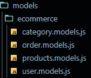
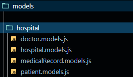

## Ecommerce Data Modelling

- `models` directory structure

  

- `user.models.js`
  
  ```
    import mongoose from 'mongoose';

    const userSchema = new mongoose.Schema(
    {
        username: {
            type: String,
            required: true,
            unique: true,
            lowercase: true,
        },
        email: {
            type: String,
            required: true,
            unique: true,
            lowercase: true,
        },
        password: {
            type: string,
            required: true,
        },
    },
    { timestamps: true }
    );

    export const User = mongoose.model('User', userSchema);
  ```

- `category.models.js`
  
  ```
    import mongoose from 'mongoose';

    const categorySchema = new mongoose.Schema(
    {
        name: {
            type: String,
            required: true,
        },
    },
    { timestamps: true }
    );

    export const Category = mongoose.model('Category', categorySchema);
  ```

- `products.models.js`
  
  ```
    import mongoose from 'mongoose';

    const productSchema = new mongoose.Schema(
    {
        description: {
            required: true,
            type: String,
        },
        name: {
            required: true,
            type: String,
        },
        productImage: {
            type: String,
        },
        price: {
            type: Number,
            default: 0,
        },
        stock: {
            default: 0,
            type: Number,
        },
        category: {
            type: mongoose.Schema.Types.ObjectId,
            ref: 'Category',
            required: true,
        },
        owner: {
            type: mongoose.Schema.Types.ObjectId,
            ref: 'User',
        },
    },
    { timestamps: true }
    );

    export const Product = mongoose.model('Product', productSchema);
  ```

- `order.models.js`
  
```
    import mongoose from 'mongoose';

    const orderItemSchema = new mongoose.Schema({
    productId: {
        type: mongoose.Schema.Types.ObjectId,
        ref: 'Product',
    },
    quantity: {
        type: Number,
        required: true,
    },
    });

    const orderSchema = new mongoose.Schema(
    {
        orderPrice: {
            type: Number,
            required: true,
        },
        customer: {
            type: mongoose.Schema.Types.ObjectId,
            ref: 'User',
        },
        orderItems: {
            type: [orderItemSchema],
        },
        address: {
            type: String,
            required: true,
        },
        status: {
            type: String,
            enum: ['PENDING', 'CANCELLED', 'DELIVERED'],
            default: 'PENDING',
        },
    },
    { timestamps: true }
    );

    export const Order = mongoose.model('Order', orderSchema);

```

## Hospital Data Modelling

- `models` directory structure
  
  

- `hospital.models.js`
  
```
  import mongoose from 'mongoose';

    const hospitalSchema = new mongoose.Schema(
    {
        name: {
            type: String,
            required: true,
        },
        addressLine1: {
            type: String,
            required: true,
        },
        addressLine2: {
            type: String,
        },
        city: {
            type: String,
            required: true,
        },
        pincode: {
            type: String,
            required: true,
        },
        specializedIn: [
        {
            type: String,
        },
        ],
    },
    { timestamps: true }
    );

    export const Hospital = mongoose.model('Hospital', hospitalSchema);

```

- `doctor.models.js`

```
import mongoose from 'mongoose';

const doctorSchema = new mongoose.Schema(
  {
    name: {
      type: String,
      required: true,
    },
    salary: {
      type: String,
      required: true,
    },
    qualification: {
      type: String,
      required: true,
    },
    experienceInYears: {
      type: Number,
      defaut: 0,
    },
    worksInHospitals: [
      {
        type: mongoose.Schema.Types.ObjectId,
        ref: 'Hospital',
      },
    ],
  },
  { timestamps: true }
);

export const Doctor = mongoose.model('Doctor', doctorSchema);

```
- `patient.models.js`

```
import mongoose from 'mongoose';

const patientSchema = new mongoose.Schema(
  {
    name: {
      type: String,
      required: true,
    },
    diagonsedWith: {
      type: String,
      required: true,
    },
    address: {
      type: String,
      required: true,
    },
    age: {
      type: Number,
      required: true,
    },
    bloodGroup: {
      type: String,
      required: true,
    },
    gender: {
      type: String,
      enum: ['M', 'F', 'O'],
      required: true,
    },
    admittedIn: {
      type: mongoose.Schema.Types.ObjectId,
      ref: 'Hospital',
    },
  },
  { timestamps: true }
);

export const Patient = mongoose.model('Patient', patientSchema);

```

- `medicalRecord.models.js`
  
```
import mongoose from 'mongoose';

const medicalRecordSchema = new mongoose.Schema({}, { timestamps: true });

export const MedicalRecord = mongoose.model(
  'MedicalRecord',
  medicalRecordSchema
);

```