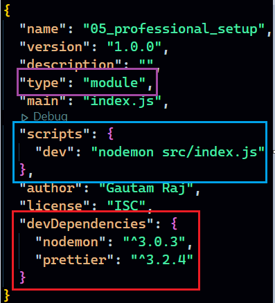
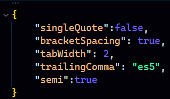
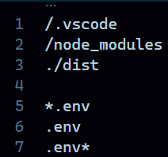
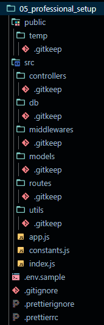
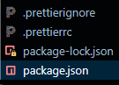

## Setting up a backend project based in node

- `npm init`
- Ideally, a project should have a **readme** file to explain various things about the project. So create a `readme.md` file.
- Open the `package.json` file that got created after `npm init`
- If you want to work with `CommonJs` (that uses **require()** syntax), then no change required, otherwise if you prefer `ModuleJs`(that uses **import** syntax), We can change type. 
- Every professional project should have `nodemon` installed as a dev dependency. Nodemon monitors for any changes in your source and automatically restart your server. Install it using `npm i -D nodemon`
- Add a `dev` script to run the server in development mode using nodemon. We can run `npm run dev` to start the server in development mode.
- Every professional project must have `prettier` installed as a dev dependency. Prettier is a code formatter that helps maintain consistent code style across your project. Install it using `npm i -D prettier`

- After installing Prettier, you might want to create a configuration file (`.prettierrc` or `prettier.config.js`) in the root of your project to customize its settings according to your preferences.
- A sample `.prettierrc` file
  
  

- But we don't want changes to occur in some important files like `.env` or files in `node_modules` folder.
- So ideally we would like to have a `.prettierignore` file.
- A sample `.prettierignore` file.

  
- Some prettier and ESLint articles to study:
  - [how-to-use-prettier-vscode](https://www.robinwieruch.de/how-to-use-prettier-vscode/)
  - [vscode-eslint](https://www.robinwieruch.de/vscode-eslint/)
  - [prettier-eslint](https://www.robinwieruch.de/prettier-eslint/)
  
- Now it's time to handle environment variables
  - Environment variables are specified in a special file `.env` in the project's root directory, for using this we must install `dotenv` package using `npm i dotenv`.
  - As this is confidential, this should not be uploaded on platforms like git so we will also create a `.env.sample` file for other users/developers to see just the structure.
  - Just create these files, later on someone who is working with database and all will fill these files with details.

- Now it's time to create different directories.
- First of all create a `public` directory and Inside this create a `temp` directory. 
  - It comes handy when we want to upload our file/images to a third party service like Cloudinary, AWS etc. We temporarily keep our files/images inside temp folder for any contingency that may occur.
- Then create a `src` directory
  - Inside this create the following directories:`controllers`, `db`, `middlewares`, `models`, `routes`, `utils`
  - And inside the `src` directory create the following files: `app.js`, `constants.js`, `index.js`

- If we are working with git, then in the project's root directory we must add `.gitignore` file so that unnecessary or confidential things(like environment variables) don't get uploaded.
- This is how a professional setup is done.

  
- Additionally if you want to push all these to git. Then we have a problem right now as empty folders are not added by git. So we can create  a `.gitkeep` file inside every folder just so that git can add them.

